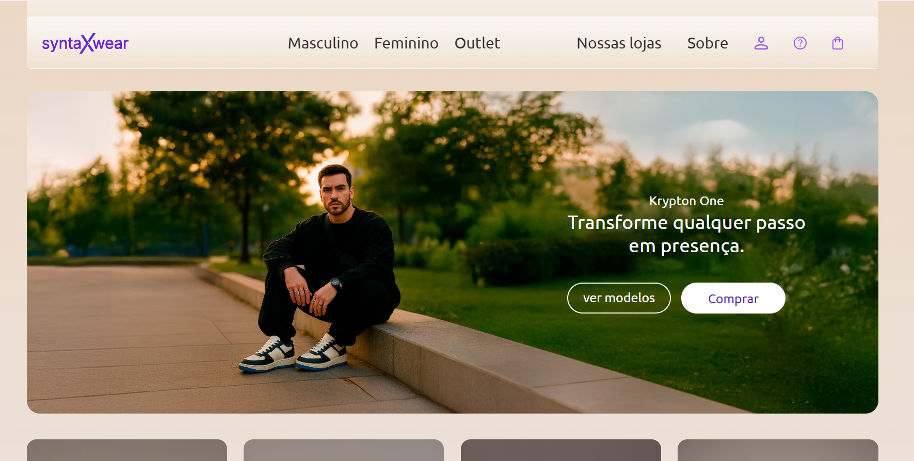

# SyntaxWear-Calçados

Bem-vindo ao repositório oficial da SyntaxWear, um projeto de e-commerce de front-end totalmente responsivo, focado na apresentação e venda de calçados.



## Tabela de conteúdos

- [Visão Geral](#visao-geral)
- [Live Demo](#live-demo)
- [Features](#features)
- [Tecnologias Utilizadas](#tecnologias-utilizadas)
- [Estrutura de Pastas](#estrutura-de-pastas)
- [Como obter o projeto](#como-obter-o-projeto)
- [Como Usar](#como-usar)
- [Contribuição](#contribuição)
- [Licença](#licença)
- [Autor](#autor)

## Visão Geral

SyntaxWear é a vitrine perfeita para explorar e adquirir as últimas tendências em calçados. Com um design moderno e uma interface de usuário intuitiva, este projeto foi criado para oferecer uma experiência de compra agradável e eficiente. A página inicial é composta por um cabeçalho de navegação, uma seção de herói, categorias de produtos, um grid de produtos e um rodapé.

## Live Demo

[Clique aqui](https://vercel.com/priscila-santos-projects-d78cb561/ecommerce-syntaxwear-calcados/2a6e36hyaHdT1ppp2UMoQRb9t2G4) para ver o projeto em ação.

## Features

- **Design Responsivo:** Totalmente adaptável para desktops, tablets e smartphones.
- **Navegação Intuitiva:** Menu de navegação claro e botões de fácil acesso.
- **Grid de Produtos Dinâmico:** Apresentação atraente dos produtos.
- **Categorias de Produtos:** Seções dedicadas para diferentes estilos de calçados.
- **Hover Effects:** Efeitos sutis de hover para melhorar a interatividade.

## Tecnologias Utilizadas

Este projeto foi construído utilizando as seguintes tecnologias:

- **HTML5:** Para a estrutura semântica do site.
- **CSS3:** Para estilização, layout e responsividade.
- **CSS Flexbox & Grid:** Para a criação de layouts complexos e responsivos.
- **Design Responsivo:** Media queries para garantir a compatibilidade com diversos dispositivos.

## Estrutura de Pastas

A estrutura de pastas do projeto está organizada da seguinte forma:

```
ecommerce-syntaxwear/
│
├── index.html               # Arquivo principal HTML
├── README.md                # Documentação do projeto
├── reset.css                # Reset de estilos do navegador
│
└─── assets/
     ├─── css/                # Arquivos de estilo
     │    ├─── header.css
     │    ├─── styles.css
     │    ├─── variables.css
     │    └─── componentes/
     │         ├─── base.css
     │         ├─── footer.css
     │         ├─── header.css
     │         ├─── hero.css
     │         └─── product-grid.css
     │
     └─── images/             # Imagens e ícones
          ├─── card_imagem copy.jpg
          ├─── cart-icon.svg
          ├─── ...
          └─── products/
               ├─── ...
```

## Como obter o projeto

Para obter uma cópia local deste projeto, siga estes passos:

1. **Clone o repositório:**
   ```bash
   git clone https://github.com/priscila-ssantos/ecommerce-syntaxwear.git
   ```
2. **Navegue até o diretório do projeto:**
   ```bash
   cd ecommerce-syntaxwear
   ```

## Como Usar

Depois de clonar o repositório, você pode simplesmente abrir o arquivo `index.html` em seu navegador para visualizar o site. Explore as diferentes seções, navegue pelas categorias e veja os produtos em destaque.

## Contribuição

Contribuições são o que tornam a comunidade de código aberto um lugar incrível para aprender, inspirar e criar. Qualquer contribuição que you fizer será **muito apreciada**.

1. Faça um Fork do projeto
2. Crie sua Feature Branch (`git checkout -b feature/AmazingFeature`)
3. Commit suas mudanças (`git commit -m 'Add some AmazingFeature'`)
4. Faça o Push para a Branch (`git push origin feature/AmazingFeature`)
5. Abra um Pull Request

## Licença

Distribuído sob a licença MIT. Veja `LICENSE` para mais informações.

## Autor

- **Priscila Santos** - *Desenvolvedor Front-End* - [LinkedIn](https://www.linkedin.com/in/priscila-santos-a49b00194/) - [GitHub](https://github.com/priscila-ssantos)